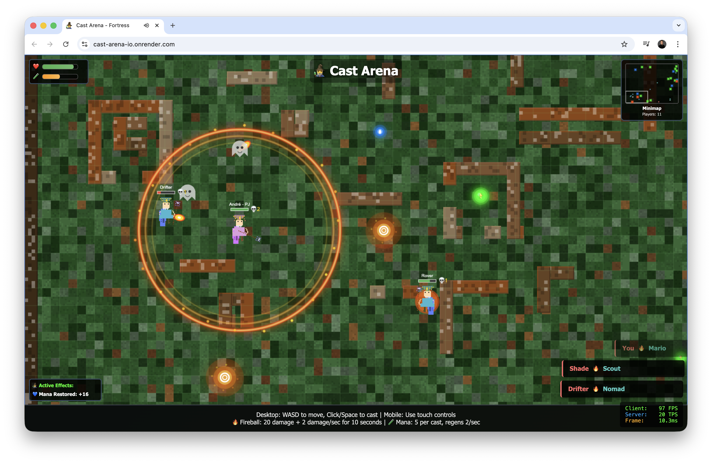

# 🧙‍♂️ Cast Arena - Multiplayer Wizard Battle

A real-time multiplayer wizard battle arena game where players can join, move around, and cast spells in an epic magical showdown!

## 🎮 Play Now

**Live Game:** [https://cast-arena-io.onrender.com](https://cast-arena-io.onrender.com)

*Note: The server may take 30-60 seconds to wake up if it's been inactive.*



*Live multiplayer wizard battles with spells, items, and real-time combat!*

## 🎯 How to Play

- **Move:** Use WASD or Arrow keys to move your wizard
- **Cast Spells:** Click or press Space to cast spells at your cursor
- **Mobile:** Touch controls available for mobile devices
- **Objective:** Battle other players and climb the leaderboard!

## 🛠️ Technology Stack

- **Backend:** Node.js + Express.js
- **Real-time Communication:** Socket.IO for multiplayer functionality
- **Frontend:** HTML5 Canvas + Vanilla JavaScript
- **Hosting:** Render.com (free tier)
- **Storage:** In-memory (no database required)

## 🚀 Features

- ✅ **Real-time multiplayer** - Battle other players live
- ✅ **Spell combat** - Cast fireballs and Ring of Fire spells
- ✅ **Smart AI bots** - Play against intelligent opponents
- ✅ **Tactical movement** - Speed boost by casting behind you
- ✅ **Kill rewards** - Gain health and mana for each kill
- ✅ **Power-ups** - Collect speed boosts and mana items
- ✅ **Mobile friendly** - Works on desktop and mobile devices

## 🔧 Local Development

Want to run the game locally or contribute?

```bash
# Clone the repository
git clone https://github.com/andreped/cast-arena.io.git
cd cast-arena.io

# Install dependencies
npm install

# Start the server
npm start

# Open your browser to http://localhost:3000
```

## 📝 License

This project is open source and available under the [MIT License](LICENSE).
