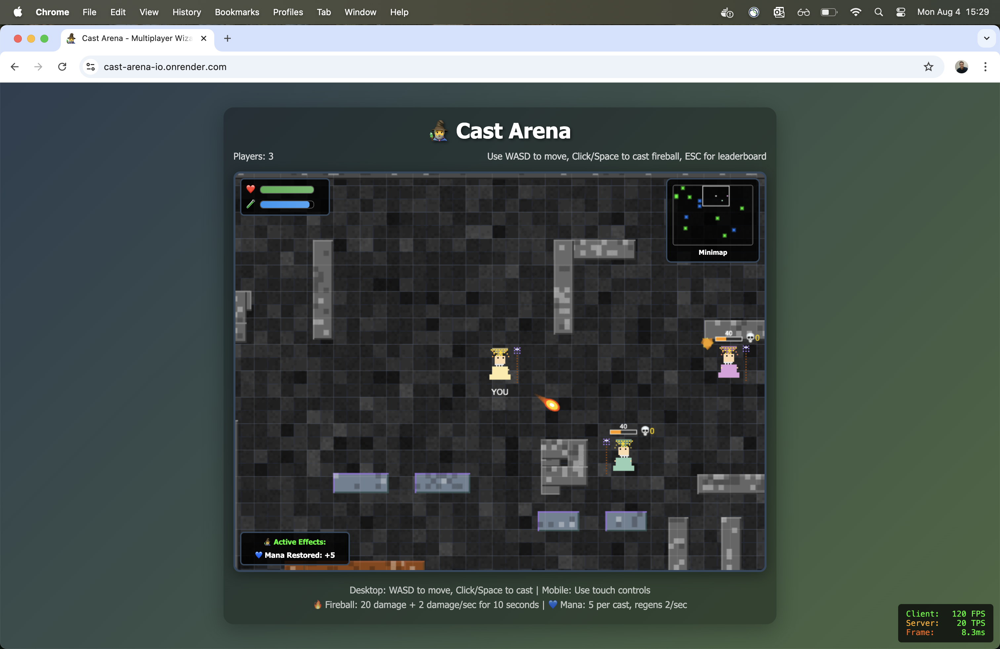

# 🧙‍♂️ Cast Arena - Multiplayer Wizard Battle

A real-time multiplayer wizard battle arena game where players can join, move around, and cast spells in an epic magical showdown!

## 🎮 Play Now

**Live Game:** [https://cast-arena-io.onrender.com](https://cast-arena-io.onrender.com)

*Note: The server may take 30-60 seconds to wake up if it's been inactive.*



*Live multiplayer wizard battles with spells, items, and real-time combat!*

## 🎯 How to Play

- **Move:** Use WASD or Arrow keys to move your wizard around the arena
- **Cast Spells:** Click or press Space to cast fireballs at your cursor location
- **Mobile Support:** Touch controls available for mobile devices
- **Collect Items:** Pick up speed boosts and mana potions scattered around the arena
- **Battle:** Defeat other players to climb the leaderboard!
- **Multiplayer:** Share the link with friends - everyone can play together in real-time!

## 🛠️ Technology Stack

- **Backend:** Node.js + Express.js
- **Real-time Communication:** Socket.IO for multiplayer functionality
- **Frontend:** HTML5 Canvas + Vanilla JavaScript
- **Hosting:** Render.com (free tier)
- **Storage:** In-memory (no database required)

## 🚀 Features

- ✅ Real-time multiplayer movement
- ✅ Spell casting system with fireballs
- ✅ Health and mana systems
- ✅ Combat with burn effects
- ✅ Item pickups (speed boosts & mana potions)
- ✅ Player stats UI with health/mana bars
- ✅ Active effects display
- ✅ Leaderboard with kill tracking
- ✅ Death and respawn mechanics
- ✅ Beautiful wizard pixel art
- ✅ Responsive game canvas with minimap
- ✅ Performance monitoring (FPS/TPS display)
- ✅ Cross-platform (desktop and mobile controls)
- 🔄 More spells and abilities (coming soon)
- 🔄 Team modes (coming soon)

## 🔧 Local Development

Want to run the game locally or contribute?

```bash
# Clone the repository
git clone https://github.com/andreped/cast-arena.io.git
cd cast-arena.io

# Install dependencies
npm install

# Start the server
npm start

# Open your browser to http://localhost:3000
```

## 📝 License

This project is open source and available under the [MIT License](LICENSE).
